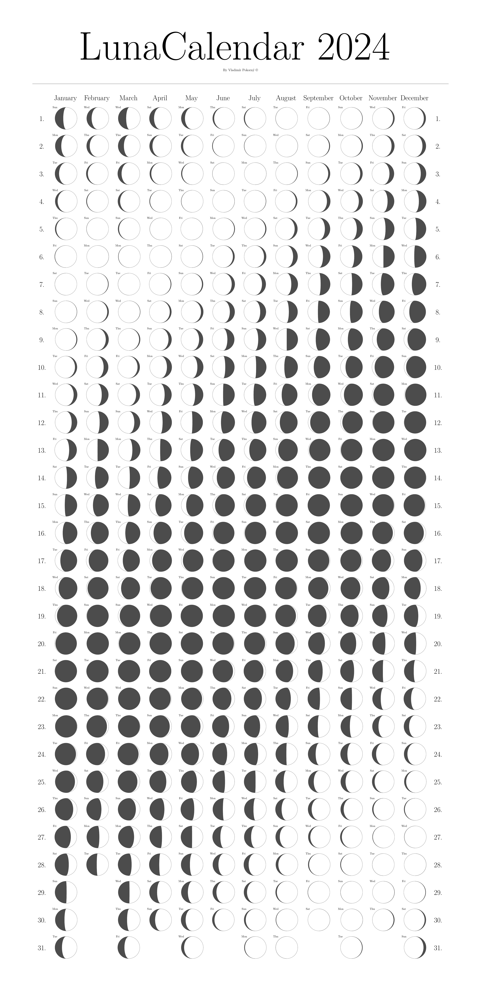

# Luna Calendar

Luna Calendar is easy Python app to generate LaTeX code to print moon phases in one year. The only one input argument is a year of Luna Calendar. The output is a *.tex file and *.pdf file with Luna Calendar.

## Prerequisity:

Installed LaTeX distribution:
- Windows: https://miktex.org/
- Linux: https://www.tug.org/texlive/
- MacOS: https://www.tug.org/mactex/

## Usage
1. install and activate virtual environment: 
    - install venv: `python -m venv \.venv\`
    - run the virtual environment by: `.venv\Scripts\activate`
    - install necessary packages: `pip install -r requirements.txt`
2. run `python main.py -y YEAR` where flag -y points to YEAR which is an integer of calendar year
    - When the year is not pass with -y flag, the actual year is used instead of it.
    - example of usage:

```python
python main.py -y 2024
```

Upper code creates the TeX source file and compiles it by `pdflatex` to the below pdf:

## Output
View [Output PDF](Luna_calendar_tex_header.pdf) or take a look to the png preview:




